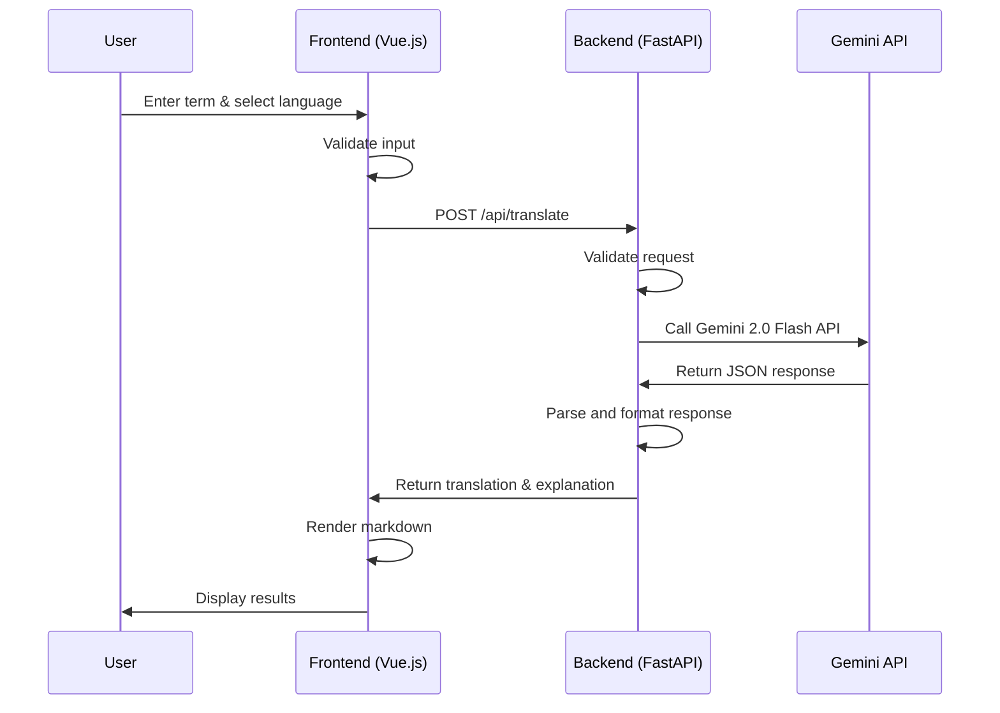

# Vocabloom Technical Design

**Document Version:** 2.0
**Last Updated:** July 26, 2025
**Status:** MVP Complete ✅

---

## 1. Overview

This document outlines the technical architecture, technology choices, and infrastructure for Vocabloom. The MVP has been successfully implemented and deployed to production.

**Production URLs:**
- **Frontend**: https://vocabloom.app (custom domain) / https://vocabloom-467020.web.app (Firebase)
- **Backend**: https://vocabloom-api-18560061448.us-central1.run.app
- **GitHub**: https://github.com/yc3136/vocabloom

---

## 2. Tech Stack Selection

### 2.1. Frontend

- **Framework:** Vue.js 3 (with TypeScript)
- **UI Library:** Vuetify 3 (for accessibility and rapid prototyping)
- **State Management:** Vue 3 Composition API (MVP)
- **Routing:** Vue Router 4
- **Form Handling:** Vue 3 reactive forms
- **Markdown Rendering:** marked.js
- **Testing:** Jest, Vue Testing Library (planned)

### 2.2. Backend

- **Language/Runtime:** Python 3.13
- **Framework:** FastAPI (for high performance, async support, and OpenAPI docs)
- **API:** REST (with OpenAPI/Swagger documentation)
- **Authentication:** None (MVP - public API)
- **Database:** None (MVP - stateless)
- **Dependency Management:** Poetry
- **Testing:** Pytest (planned)

### 2.3. AI/ML Integration

- **Provider:** Gemini 2.0 Flash API (primary for LLM-powered translation and explanation)
- **Integration:** Direct REST API calls using httpx
- **Response Format:** JSON with translation and explanation fields
- **Error Handling:** Graceful fallback with user-friendly error messages

### 2.4. Cloud & Infrastructure

- **Cloud Provider:** Google Cloud Platform (GCP)
- **Core Services:**
  - **Compute:** Cloud Run (for containerized FastAPI backend)
  - **Frontend Hosting:** Firebase Hosting
  - **Object Storage:** Google Cloud Storage (GCS) (for static assets)
  - **Secrets Management:** Secret Manager (for API keys)
  - **Monitoring:** Cloud Monitoring, Error Reporting
  - **CI/CD:** GitHub Actions, manual deployment scripts

### 2.5. DevOps & Tooling

- **Containerization:** Docker (for local development and deployment)
- **Version Control:** Git (GitHub)
- **Linting/Formatting:** ESLint, Prettier (frontend); Black, isort (backend)
- **Documentation:** Swagger (API), Markdown (internal docs)

### 2.6. Accessibility & Compliance

- **Accessibility:** WCAG 2.1 AA compliance (planned)
- **Compliance:** GDPR, CCPA (data privacy) (planned)

---

## 3. Setup Specifications

### 3.1. Local Development

- **Minimum Requirements:**  
  - Node.js >= 18.x (for frontend tooling)  
  - Python >= 3.10 (for backend)  
  - Poetry (for Python dependency management)
  - GCloud CLI (for cloud integration)  
  - npm (frontend)

- **Recommended IDE:** VSCode (with recommended extensions for TypeScript, ESLint, Prettier, Python, Docker)

### 3.2. Environments

- **Development:** Local development with hot reload
- **Production:** GCP (Cloud Run + Firebase Hosting)

---

## 4. Rationale

- **Suitability:** Vue.js and FastAPI are both modern, high-performance frameworks with strong community support and rapid development cycles. They are well-suited for building scalable, maintainable web applications and APIs.
- **Cloud Provider Choice:**
  - **GCP was chosen over AWS** for the following reasons:
    - **Cost Control:** GCP provides a $300 free credit and always-free tier, with a hard spending limit before you upgrade to a paid account, making it safer for side projects and experimentation.
    - **Gemini Integration:** Native and seamless integration with Gemini API and other Google AI/ML services.
    - **Managed Services:** GCP offers robust managed services for compute, storage, database, and monitoring, all compatible with the project's tech stack.
    - **Developer Experience:** GCP's developer tooling and documentation are well-suited for rapid prototyping and deployment.

---

## 5. MVP Design

### 5.1. User Journey

1. **User Input:**
   - The user enters an English term and selects a target language from a dropdown menu on the web app.
   - The user submits the request.
2. **Frontend Processing:**
   - The Vue.js frontend validates the input (non-empty, valid selection).
   - A POST request is sent to the backend API with the term and selected language.
3. **Backend Processing:**
   - The FastAPI backend receives the request and validates the payload.
   - The backend calls the Gemini API to generate a translation or explanation for the term in the target language.
   - The backend processes the AI response, applies formatting, and returns the result to the frontend.
4. **Frontend Display:**
   - The frontend receives the response and displays the translation/explanation to the user.
   - If an error occurs, a user-friendly error message is shown.

### 5.2. Sequence Diagram



### 5.3. Frontend Implementation

- **Framework:** Vue.js 3 with Composition API
- **Structure:**
  - Single-page application with Vue Router
  - Home page with language selection and term input
  - About page with project information
  - Responsive design with Vuetify components
- **Key Features:**
  - Language selection dropdown with native language names
  - Real-time form validation
  - Markdown rendering for explanations
  - Loading states and error handling
  - Mobile-responsive design

### 5.4. Backend Implementation

- **Framework:** Python with FastAPI for REST API endpoints.
- **Structure:**
  - Single endpoint: `/api/translate`
  - Middleware for input validation and error handling
  - Environment-based API key management
- **API Endpoint:**
  - `POST /api/translate` — Receives `{ term, language }`, validates input, calls Gemini API, returns translation/explanation.
- **Error Handling:**
  - Centralized error handling for consistent API responses
  - Logging of errors and failed requests for monitoring

### 5.5. Gemini API Integration

- **Library:** Gemini 2.0 Flash API accessed via httpx
- **Authentication:** API key stored in GCP Secret Manager (production) or .env file (local)
- **Request Flow:**
  1. Backend constructs a prompt for Gemini API based on user input
  2. Sends request to Gemini 2.0 Flash endpoint
  3. Handles API response, including JSON parsing and formatting
  4. Returns clean translation and explanation to frontend
- **Response Format:**
  ```json
  {
    "translation": "Translated term",
    "explanation": "Markdown-formatted explanation"
  }
  ```
- **Security:**
  - API keys and secrets are never exposed to the frontend or client

### 5.6. Deployment & Operations

- **Frontend Deployment:**
  - Deployed to Firebase Hosting for global CDN and automatic SSL/TLS certificates
  - Custom domain: vocabloom.app
  - Firebase domain: vocabloom-467020.web.app

- **Backend Deployment:**
  - Deployed to Cloud Run for managed Python hosting and auto-scaling
  - Service URL: vocabloom-api-18560061448.us-central1.run.app
  - Dockerized for consistency across environments
  - Configured with automatic SSL/TLS certificates

- **Infrastructure Setup:**
  - GCP project: vocabloom-467020
  - Primary region: us-central1
  - Service account configured with appropriate permissions
  - Secret Manager configured for secure API key storage
  - Cloud Monitoring enabled for logging and metrics

- **CI/CD:**
  - **Deployment Scripts:** Manual deployment with automation scripts
    - Full stack deployment: `./deploy.sh`
    - Individual deployments: `./deploy-backend.sh` and `./deploy-frontend.sh`
    - Scripts include dependency checks, building, deployment, and health testing
  - Environment variables and secrets managed via GCP Secret Manager

- **Environment Variables & Secrets:**
  - Managed via GCP Secret Manager for API keys
  - Local development uses .env file (gitignored)

- **Monitoring & Logging:**
  - Cloud Monitoring for logs and metrics
  - Health check endpoint available at /health

### 5.7. Domain Setup

- **Custom Domain Configuration:**
  - **Primary Domain:** vocabloom.app (registered via Namecheap)
  - **DNS Management:** Namecheap Advanced DNS
  - **Frontend:** vocabloom.app → Firebase Hosting (vocabloom-467020.web.app)
  - **Backend:** vocabloom-api-18560061448.us-central1.run.app

- **SSL/TLS Certificates:**
  - Firebase Hosting: Automatic SSL/TLS certificate provisioning
  - Cloud Run: Automatic SSL/TLS certificates via Google-managed certificates
  - HTTPS enforced everywhere with automatic redirects

- **Domain Verification:**
  - Firebase domain verification completed
  - Custom domain fully operational

- **Security:**
  - HTTPS enforced everywhere (automatic with Cloud Run and Firebase)
  - CORS configured for vocabloom.app and Firebase domains
  - Service account permissions follow principle of least privilege
  - Domain ownership verified through DNS records

---

## 6. Future Enhancements

### 6.1. Authentication & User Management
- User registration and login functionality
- User profiles and preferences
- Role-based access control

### 6.2. Database Integration
- PostgreSQL database for user data and translation history
- Redis for caching and session management

### 6.3. Advanced Features
- Audio pronunciation using Google Cloud Text-to-Speech
- Image generation for vocabulary learning
- Translation history and favorites
- Offline functionality

### 6.4. Testing & Quality Assurance
- Comprehensive unit tests for frontend components
- Integration tests for API endpoints
- End-to-end tests for user flows
- Performance testing and monitoring 