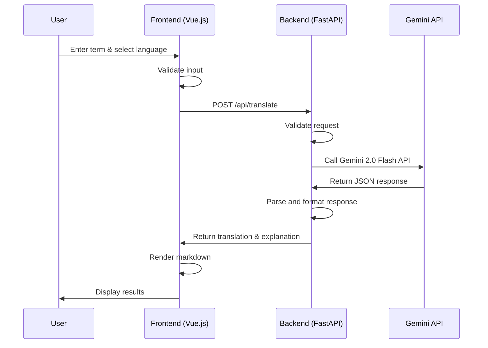
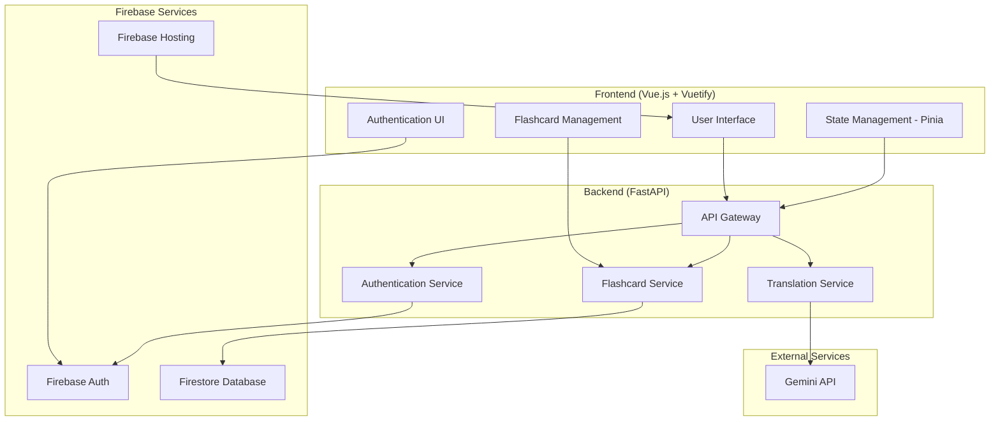

# Vocabloom Technical Design

**Document Version:** 2.1
**Last Updated:** July 26, 2025
**Status:** MVP Complete ✅ | Milestone 2 In Progress 🚧

---

## 1. Overview

This document outlines the technical architecture, technology choices, and infrastructure for Vocabloom. The MVP has been successfully implemented and deployed to production. Milestone 2 focuses on user account management and flashcard features.

**Production URLs:**
- **Frontend**: https://vocabloom.app (custom domain) / https://vocabloom-467020.web.app (Firebase)
- **Backend**: https://vocabloom-api-18560061448.us-central1.run.app
- **GitHub**: https://github.com/yc3136/vocabloom

---

## 2. Tech Stack Selection

### 2.1. Frontend

- **Framework:** Vue.js 3 (with TypeScript)
- **UI Library:** Vuetify 3 (for accessibility and rapid prototyping)
- **State Management:** Vue 3 Composition API (MVP) → Pinia (Milestone 2)
- **Routing:** Vue Router 4
- **Form Handling:** Vue 3 reactive forms
- **Markdown Rendering:** marked.js
- **Testing:** Jest, Vue Testing Library (planned)

### 2.2. Backend

- **Language/Runtime:** Python 3.13
- **Framework:** FastAPI (for high performance, async support, and OpenAPI docs)
- **API:** REST (with OpenAPI/Swagger documentation)
- **Authentication:** Firebase Auth (Milestone 2)
- **Database:** Cloud SQL (PostgreSQL) (Milestone 2) - Relational database
- **ORM:** SQLAlchemy (for database operations)
- **Dependency Management:** Poetry
- **Testing:** Pytest (planned)

### 2.3. AI/ML Integration

- **Provider:** Gemini 2.0 Flash API (primary for LLM-powered translation and explanation)
- **Integration:** Direct REST API calls using httpx
- **Response Format:** JSON with translation and explanation fields
- **Error Handling:** Graceful fallback with user-friendly error messages

### 2.4. Cloud & Infrastructure

- **Cloud Provider:** Google Cloud Platform (GCP)
- **Core Services:**
  - **Compute:** Cloud Run (for containerized FastAPI backend)
  - **Frontend Hosting:** Firebase Hosting
  - **Authentication:** Firebase Auth (user management, OAuth providers)
  - **Database:** Cloud SQL (PostgreSQL) (relational database for user data and flashcards)
  - **Object Storage:** Google Cloud Storage (GCS) (for static assets)
  - **Secrets Management:** Secret Manager (for API keys and database credentials)
  - **Monitoring:** Cloud Monitoring, Error Reporting
  - **CI/CD:** GitHub Actions, manual deployment scripts

### 2.5. DevOps & Tooling

- **Containerization:** Docker (for local development and deployment)
- **Version Control:** Git (GitHub)
- **Linting/Formatting:** ESLint, Prettier (frontend); Black, isort (backend)
- **Documentation:** Swagger (API), Markdown (internal docs)

### 2.6. Accessibility & Compliance

- **Accessibility:** WCAG 2.1 AA compliance (planned)
- **Compliance:** GDPR, CCPA (data privacy) (planned)

---

## 3. Setup Specifications

### 3.1. Local Development

- **Minimum Requirements:**  
  - Node.js >= 18.x (for frontend tooling)  
  - Python >= 3.10 (for backend)  
  - Poetry (for Python dependency management)
  - GCloud CLI (for cloud integration)  
  - npm (frontend)
  - Firebase CLI (for local development and deployment)
  - PostgreSQL client (for local database development)

- **Recommended IDE:** VSCode (with recommended extensions for TypeScript, ESLint, Prettier, Python, Docker)

### 3.2. Environments

- **Development:** Local development with hot reload
- **Production:** GCP (Cloud Run + Firebase Hosting + Cloud SQL)

### 3.3. Environment Separation Strategy

The application uses a complete environment separation strategy to ensure local development and production environments never interfere with each other.

#### 3.3.1. Environment Detection

**Backend Environment Detection:**
```python
ENVIRONMENT = os.getenv("ENVIRONMENT", "local")
if ENVIRONMENT == "production":
    # Production logic
else:
    # Local development logic
```

**Frontend Environment Detection:**
```typescript
const isProduction = import.meta.env.PROD;
const isLocal = import.meta.env.DEV;
```

#### 3.3.2. Database Configuration

**Local Development:**
- **Database:** Local PostgreSQL instance
- **Connection:** Direct TCP connection to localhost
- **Credentials:** Environment variables in `.env` files
- **Migration:** Alembic with local database

**Production:**
- **Database:** Cloud SQL PostgreSQL instance
- **Connection:** Cloud SQL Auth Proxy
- **Credentials:** Google Cloud Secret Manager
- **Migration:** Alembic with production database

#### 3.3.3. Secret Management

**Local Development:**
- **Source:** Environment variables in `.env` files
- **Storage:** Local files (gitignored)
- **Access:** Direct environment variable access

**Production:**
- **Source:** Google Cloud Secret Manager
- **Storage:** Encrypted cloud storage
- **Access:** Service account with Secret Manager permissions

#### 3.3.4. Frontend-Backend Communication

**Local Development:**
- **Frontend → Backend:** `http://localhost:8000`
- **Backend → Database:** Local PostgreSQL
- **Authentication:** Firebase Auth (same project as production)

**Production:**
- **Frontend → Backend:** Cloud Run URL (dynamic)
- **Backend → Database:** Cloud SQL
- **Authentication:** Firebase Auth (same project as local)

#### 3.3.5. Configuration Files

**Backend Configuration:**
```
server/
├── .env (local development - gitignored)
├── .env.production (production template)
└── env.example (template for local setup)
```

**Frontend Configuration:**
```
client/
├── .env (local development - gitignored)
├── .env.production (production build)
└── env.example (template for local setup)
```

#### 3.3.6. Environment-Specific Features

**Local Development Benefits:**
- **Offline Development:** Works without internet connection
- **Fast Iteration:** Hot reload for both frontend and backend
- **Debugging:** Full access to logs and error messages
- **Database Control:** Direct access to local database

**Production Benefits:**
- **Scalability:** Cloud Run auto-scaling
- **Security:** Managed secrets and credentials
- **Reliability:** High availability and backups
- **Monitoring:** Cloud Monitoring and Error Reporting

#### 3.3.7. Migration Strategy

**Local Migrations:**
```bash
cd server
poetry run alembic upgrade head  # Uses local database
```

**Note:** Migration files in `server/alembic/versions/` are generated code and should not be committed to version control. They are automatically created based on model changes and applied to the appropriate environment database.

**Production Migrations:**
```bash
# Handled by deployment pipeline
# Uses production database via Cloud SQL
```

#### 3.3.8. Security Considerations

**Local Development:**
- Environment files are gitignored to prevent credential leakage
- Uses same Firebase project as production for authentication testing
- No production secrets are accessible locally

**Production:**
- All secrets stored in Google Cloud Secret Manager
- Service accounts with minimal required permissions
- CORS configured for production domains only

---

## 4. Rationale

- **Suitability:** Vue.js and FastAPI are both modern, high-performance frameworks with strong community support and rapid development cycles. They are well-suited for building scalable, maintainable web applications and APIs.
- **Cloud Provider Choice:**
  - **GCP was chosen over AWS** for the following reasons:
    - **Cost Control:** GCP provides a $300 free credit and always-free tier, with a hard spending limit before you upgrade to a paid account, making it safer for side projects and experimentation.
    - **Gemini Integration:** Native and seamless integration with Gemini API and other Google AI/ML services.
    - **Managed Services:** GCP offers robust managed services for compute, storage, database, and monitoring, all compatible with the project's tech stack.
    - **Developer Experience:** GCP's developer tooling and documentation are well-suited for rapid prototyping and deployment.
- **Database Choice for Milestone 2:**
  - **PostgreSQL on Cloud SQL:** Advanced relational database with excellent JSON support
  - **Advanced Features:** JSONB support, complex queries, better indexing
  - **GCP Integration:** Native Cloud SQL service with automatic backups and high availability
- **Firebase Auth Choice:**
  - **Rapid Development:** Ready-to-use authentication with multiple OAuth providers
  - **Cost Effective:** Generous free tier for authentication services
  - **Security:** Built-in security features and token management
  - **Integration:** Seamless integration with GCP services and PostgreSQL

---

## 5. MVP Design

### 5.1. User Journey

1. **User Input:** User enters an English term and selects a target language
2. **Frontend Processing:** Vue.js validates input and sends POST request to backend
3. **Backend Processing:** FastAPI validates payload and calls Gemini API
4. **Frontend Display:** Results are displayed with markdown rendering

### 5.2. Architecture



### 5.3. Key Components

- **Frontend:** Single-page application with Vue Router, responsive design with Vuetify
- **Backend:** Single endpoint `/api/translate` with input validation and error handling
- **AI Integration:** Gemini 2.0 Flash API with structured JSON responses
- **Deployment:** Firebase Hosting (frontend) + Cloud Run (backend)

### 5.4. Deployment & Operations

- **Frontend:** Firebase Hosting with custom domain (vocabloom.app)
- **Backend:** Cloud Run with automatic SSL/TLS certificates
- **Infrastructure:** GCP project (vocabloom-467020) with Secret Manager for API keys
- **CI/CD:** Manual deployment scripts with dependency checks and health testing
- **Monitoring:** Cloud Monitoring for logs and metrics

---

## 6. Milestone 2: User Account Management & Flashcards

### 6.1. High-Level Architecture



### 6.2. Hybrid User Experience Design

#### 6.2.1. Public vs. Authenticated Features

**Public Features (No Authentication Required):**
- Basic translation lookup and display
- Flashcard generation and preview
- Template selection and customization
- Real-time translation with Gemini API
- Responsive design and accessibility features

**Authenticated Features (Requires Sign-in):**
- Save flashcards to personal collection
- View and manage saved flashcards
- View translation history
- User preferences and settings

#### 6.2.2. User Journey Flow

**Anonymous User Journey:**
1. User visits vocabloom.app
2. User can immediately use translation feature
3. User can generate and preview flashcards
4. When user tries to save a flashcard → authentication prompt
5. User can choose to sign in or continue without saving

**Authenticated User Journey:**
1. User signs in (optional for basic features)
2. All public features available
3. Additional personalized features unlocked
4. Seamless save and management capabilities

#### 6.2.3. Authentication Prompt Strategy

**Trigger Points for Authentication:**
- User clicks "Save Flashcard" button
- User tries to access "My Flashcards" dashboard
- User tries to view translation history

**User Experience:**
- Non-intrusive authentication prompts
- Clear value proposition for signing up
- Option to continue without authentication
- Smooth transition from anonymous to authenticated state

### 6.3. User Account Management

#### 6.3.1. Authentication Architecture

**Technology Stack:**
- **Firebase Authentication:** Primary authentication service
- **Supported Providers:** Email/Password, Google OAuth
- **Frontend Integration:** Firebase Auth SDK for Vue.js
- **Backend Integration:** Firebase Admin SDK for Python

**Key Features:**
- Optional authentication for basic features
- Seamless sign-in flow when needed
- User session management and logout functionality
- Protected API endpoints with middleware authentication

#### 6.2.2. Database Schema (PostgreSQL)

**Tables Structure:**

**Users Table (`users`):**
```sql
CREATE TABLE users (
    id VARCHAR(128) PRIMARY KEY, -- Firebase UID
    email VARCHAR(255) UNIQUE NOT NULL,
    display_name VARCHAR(255),
    created_at TIMESTAMP DEFAULT CURRENT_TIMESTAMP,
    last_login_at TIMESTAMP,
    preferences JSONB -- Store user preferences as JSON
);
```

**Flashcards Table (`flashcards`):**
```sql
CREATE TABLE flashcards (
    id SERIAL PRIMARY KEY,
    user_id VARCHAR(128) NOT NULL,
    original_word VARCHAR(255) NOT NULL,
    translated_word VARCHAR(255) NOT NULL,
    example_sentences JSONB, -- Array of example sentences
    template VARCHAR(50) DEFAULT 'classic',
    colors JSONB, -- Store color scheme as JSON
    created_at TIMESTAMP DEFAULT CURRENT_TIMESTAMP,
    updated_at TIMESTAMP DEFAULT CURRENT_TIMESTAMP,
    FOREIGN KEY (user_id) REFERENCES users(id) ON DELETE CASCADE
);
```

**Translations Table (`translations`):**
```sql
CREATE TABLE translations (
    id SERIAL PRIMARY KEY,
    user_id VARCHAR(128) NOT NULL,
    original_term VARCHAR(255) NOT NULL,
    target_language VARCHAR(10) NOT NULL,
    translation TEXT NOT NULL,
    explanation TEXT,
    bookmarked BOOLEAN DEFAULT FALSE,
    created_at TIMESTAMP DEFAULT CURRENT_TIMESTAMP,
    FOREIGN KEY (user_id) REFERENCES users(id) ON DELETE CASCADE
);
```

**Indexes for Performance:**
```sql
CREATE INDEX idx_flashcards_user_id ON flashcards(user_id);
CREATE INDEX idx_translations_user_id ON translations(user_id);
CREATE INDEX idx_translations_created_at ON translations(created_at);
CREATE INDEX idx_flashcards_examples ON flashcards USING GIN (example_sentences);
CREATE INDEX idx_users_preferences ON users USING GIN (preferences);
```

#### 6.2.3. Database Security

**Connection Security:**
- **Cloud SQL Proxy:** Secure connection to Cloud SQL instance
- **SSL/TLS Encryption:** Automatic encryption for all database connections
- **IAM Integration:** Service account-based authentication
- **Network Security:** Private IP connections within GCP VPC

**Data Security:**
- **Row-Level Security:** Users can only access their own data
- **Foreign Key Constraints:** Maintain data integrity
- **Input Validation:** SQLAlchemy ORM validation and sanitization
- **Backup Encryption:** Automatic encrypted backups

### 6.4. Flashcard System

#### 6.4.1. Flashcard Creation Flow

**Anonymous User Journey:**
1. User performs translation lookup (no authentication required)
2. System displays "Create Flashcard" button
3. User opens flashcard creation modal
4. User selects example sentences and customizes appearance
5. User can preview flashcard without saving
6. When user clicks "Save" → authentication prompt appears
7. User can sign in to save or continue without saving

**Authenticated User Journey:**
1. User performs translation lookup
2. System displays "Create Flashcard" button
3. User opens flashcard creation modal
4. User selects example sentences and customizes appearance
5. User saves flashcard directly to PostgreSQL

**Key Features:**
- Multiple example sentence selection
- Template-based customization (Classic, Modern, Minimal)
- Color and font customization
- Category organization (authenticated users only)
- Real-time preview without saving

#### 6.4.2. Flashcard Management (Authenticated Only)

**Dashboard Features:**
- Grid and list view modes
- Search and filter functionality
- Sorting options (date, alphabetical, last modified)

**Template System:**
- 3 predefined templates (Classic, Modern, Minimal)
- Customizable colors, fonts, and layouts
- Responsive design for desktop and mobile
- Professional appearance for printing

### 6.5. API Endpoints

#### 6.5.1. Public Endpoints (No Authentication)
- `POST /api/translate` - Basic translation (existing MVP endpoint)
- `POST /api/flashcards/preview` - Generate flashcard preview

#### 6.5.2. Authentication Endpoints
- `POST /api/auth/register` - User registration via Firebase Auth
- `POST /api/auth/login` - User login via Firebase Auth
- `POST /api/auth/logout` - User logout

#### 6.5.3. Protected Endpoints (Requires Authentication)
- `GET /api/flashcards` - Get user's flashcards (with filtering)
- `POST /api/flashcards` - Save flashcard to user collection
- `PUT /api/flashcards/{id}` - Update flashcard
- `DELETE /api/flashcards/{id}` - Delete flashcard
- `GET /api/translations/history` - Get user's translation history

### 6.6. Database Operations

#### 6.6.1. Database Connection
- **Cloud SQL Proxy:** Secure connection to Cloud SQL instance
- **SQLAlchemy ORM:** Object-relational mapping for database operations
- **Connection Pooling:** Efficient database connection management
- **Environment Configuration:** Database credentials via Secret Manager

#### 6.6.2. Model Definitions
- **User Model:** Firebase UID integration with PostgreSQL
- **Flashcard Model:** Complete flashcard data with JSONB fields
- **Translation Model:** User translation history tracking
- **Relationships:** Proper foreign key relationships and cascading

#### 6.6.3. Authentication Flow
- **Firebase Auth Integration:** Token verification with PostgreSQL user sync
- **Protected Endpoints:** Middleware authentication for user-specific data
- **User Session Management:** Secure token handling and validation
- **Anonymous vs. Authenticated:** Hybrid access control

### 6.7. State Management

**Pinia Stores:**
- **Auth Store:** User authentication state and methods
- **Flashcard Store:** Flashcard data and CRUD operations (authenticated)
- **Translation Store:** Current translation state (public)

**Anonymous User State:**
- Current translation results
- Flashcard preview data
- UI state and preferences (local storage)

**Authenticated User State:**
- All anonymous user state
- Saved flashcards collection
- Translation history
- User preferences

### 6.8. Deployment Considerations

#### 6.8.1. Cloud SQL Setup

**Required Cloud SQL Configuration:**
- **Instance Type:** PostgreSQL 14 or higher
- **Machine Type:** db-f1-micro (free tier) or db-g1-small for production
- **Storage:** 10GB minimum (SSD)
- **Backup:** Automatic daily backups
- **High Availability:** Optional for production
- **Connections:** Cloud SQL Proxy for secure connections

#### 6.8.2. Environment Variables

**Backend Environment:**
- Database connection string via Secret Manager
- Firebase Admin SDK credentials
- API keys and service account details
- Environment-specific configurations

**Frontend Environment:**
- Firebase configuration for authentication
- API endpoints and service URLs
- Feature flags and environment indicators

#### 6.8.3. Database Migration

**Alembic for Database Migrations:**
- Version-controlled schema changes
- Automated migration scripts
- Rollback capabilities
- Environment-specific migrations

### 6.9. Testing Strategy

#### 6.9.1. Unit Tests

**Frontend Testing:**
- Component testing with Vue Test Utils
- Store testing for Pinia state management
- Authentication flow testing
- UI interaction testing

**Backend Testing:**
- API endpoint testing with pytest
- Database operation testing
- Authentication middleware testing
- Error handling validation

#### 6.9.2. Integration Tests

**Database Integration Tests:**
- PostgreSQL connection and operations
- Firebase Auth token verification
- User data persistence and retrieval
- Flashcard CRUD operations with database

**Authentication Flow Tests:**
- User registration and login
- Protected endpoint access
- Token validation and refresh
- Anonymous vs. authenticated user flows 