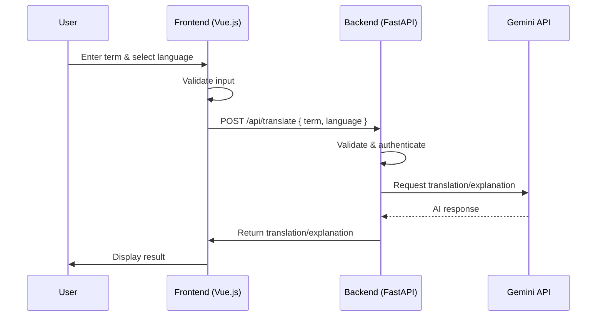

# Vocabloom Technical Design

**Document Version:** 1.1
**Last Updated:** July 25, 2025

---

## 1. Overview

This document outlines the technical architecture, technology choices, and infrastructure for Vocabloom, supporting all product requirements and milestones as described in the product requirements document.

---

## 2. Tech Stack Selection

### 2.1. Frontend

- **Framework:** Vue.js (with TypeScript)
- **UI Library:** Vuetify (for accessibility and rapid prototyping)
- **State Management:** Vuex (MVP), with potential migration to Pinia for advanced features
- **Routing:** Vue Router
- **Form Handling:** Vuelidate or VueUseForm
- **Internationalization:** vue-i18n
- **Testing:** Jest, Vue Testing Library, Cypress (E2E)

### 2.2. Backend

- **Language/Runtime:** Python 3.x
- **Framework:** FastAPI (for high performance, async support, and OpenAPI docs)
- **API:** REST (with OpenAPI/Swagger documentation), with GraphQL considered for future extensibility
- **Authentication:** JWT (JSON Web Tokens), OAuth 2.0 (Google, Apple, etc.)
- **Database:** PostgreSQL (primary), Redis (caching, session management)
- **ORM:** SQLAlchemy (for PostgreSQL)
- **Testing:** Pytest, HTTPX

### 2.3. AI/ML Integration

- **Provider:** Gemini API (primary for LLM-powered translation, explanation, and image generation)
- **Image Generation:** Gemini API (primary); fallback to OpenAI DALL·E or Stability AI if quality or moderation needs are not met
- **Image Moderation:** Use Gemini API’s built-in moderation where possible; supplement with OpenAI Moderation API, Google Cloud Vision SafeSearch, or AWS Rekognition for stricter requirements
- **Audio/Video:** Google Cloud Text-to-Speech, AWS Polly, or ElevenLabs (for audio pronunciation)

### 2.4. Cloud & Infrastructure

- **Cloud Provider:** Google Cloud Platform (GCP) (preferred for cost control, managed services, and Gemini integration)
- **Core Services:**
  - **Compute:** Cloud Run (for containerized FastAPI backend) or Cloud Functions (for serverless workloads)
  - **Database:** Cloud SQL (PostgreSQL)
  - **Object Storage:** Google Cloud Storage (GCS) (for images, audio, exports)
  - **CDN:** Cloud CDN
  - **Cache:** MemoryStore (Redis)
  - **Authentication:** Firebase Authentication (optional, if not rolling custom JWT/OAuth)
  - **Monitoring:** Cloud Monitoring, Error Reporting (for error tracking)
  - **CI/CD:** GitHub Actions, Cloud Build

### 2.5. DevOps & Tooling

- **Containerization:** Docker (for local development and deployment)
- **Infrastructure as Code:** Terraform or Google Cloud Deployment Manager
- **Version Control:** Git (GitHub)
- **Linting/Formatting:** ESLint, Prettier (frontend); Black, isort, flake8 (backend)
- **Documentation:** Storybook (UI), Swagger (API), Markdown (internal docs)

### 2.6. Accessibility & Compliance

- **Accessibility Testing:** axe-core, Lighthouse
- **Compliance:** GDPR, CCPA (data privacy), WCAG 2.1 AA (accessibility)

---

## 3. Setup Specifications

### 3.1. Local Development

- **Minimum Requirements:**  
  - Node.js >= 18.x (for frontend tooling)  
  - Python >= 3.10 (for backend)  
  - Docker Desktop  
  - PostgreSQL (local or Dockerized)  
  - Redis (local or Dockerized)  
  - GCloud CLI (for cloud integration)  
  - Yarn, npm, or pnpm (frontend)

- **Recommended IDE:** VSCode (with recommended extensions for TypeScript, ESLint, Prettier, Python, Docker)

### 3.2. Environments

- **Development:** Local Docker Compose, feature branches
- **Staging:** GCP (mirrors production, used for QA)
- **Production:** GCP (multi-region, auto-scaling, managed services)

---

## 4. Rationale

- **Suitability:** Vue.js and FastAPI are both modern, high-performance frameworks with strong community support and rapid development cycles. They are well-suited for building scalable, maintainable web applications and APIs.
- **Cloud Provider Choice:**
  - **GCP was chosen over AWS** for the following reasons:
    - **Cost Control:** GCP provides a $300 free credit and always-free tier, with a hard spending limit before you upgrade to a paid account, making it safer for side projects and experimentation.
    - **Gemini Integration:** Native and seamless integration with Gemini API and other Google AI/ML services.
    - **Managed Services:** GCP offers robust managed services for compute, storage, database, and monitoring, all compatible with the project’s tech stack.
    - **Developer Experience:** GCP’s developer tooling and documentation are well-suited for rapid prototyping and deployment.

---

## 5. MVP Design

### 5.1. User Journey

1. **User Input:**
   - The user enters an English term and selects a target language from a dropdown menu on the web app.
   - The user submits the request.
2. **Frontend Processing:**
   - The Vue.js frontend validates the input (non-empty, valid selection).
   - A POST request is sent to the backend API with the term and selected language.
3. **Backend Processing:**
   - The FastAPI backend receives the request, authenticates the user (if required), and validates the payload.
   - The backend calls the Gemini API to generate a translation or explanation for the term in the target language.
   - The backend processes the AI response, applies any necessary formatting or error handling, and returns the result to the frontend.
4. **Frontend Display:**
   - The frontend receives the response and displays the translation/explanation to the user.
   - If an error occurs (e.g., invalid input, API failure), a user-friendly error message is shown.

### 5.2. Sequence Diagram

### 5.3. Error Handling
- Input validation on both frontend and backend
- Graceful error messages for failed AI requests or invalid input
- Logging and monitoring for backend/API errors

### 5.4. Extensibility
- The architecture allows for easy addition of features such as user accounts, image generation, and history/bookmarks in future milestones.

---

### 5.5. Backend Implementation

- **Framework:** Python with FastAPI for REST API endpoints.
- **Structure:**
  - Modular route handlers (e.g., `/api/translate`)
  - Middleware for input validation, authentication (if enabled), and error handling
  - SQLAlchemy ORM for database access (user data, logs, etc.)
- **API Endpoint Example:**
  - `POST /api/translate` — Receives `{ term, language }`, validates input, calls Gemini API, returns translation/explanation.
- **Error Handling:**
  - Centralized error handling for consistent API responses
  - Logging of errors and failed requests for monitoring

---

### 5.6. Gemini API Integration

- **Library:** Gemini API is accessed via official REST client or HTTP requests (e.g., using `httpx` or `requests`).
- **Authentication:** API key is securely stored in environment variables and injected at runtime.
- **Request Flow:**
  1. Backend constructs a prompt or payload for Gemini API based on user input.
  2. Sends request to Gemini API endpoint (e.g., `/v1/generate-translation`).
  3. Handles API response, including parsing, formatting, and error checking.
  4. If Gemini API returns an error or inappropriate content, backend returns a user-friendly error message.
- **Rate Limiting & Quotas:**
  - Backend monitors API usage and gracefully handles quota limits (e.g., by returning informative errors or fallback responses).
- **Security:**
  - API keys and secrets are never exposed to the frontend or client.

---

### 5.7. Deployment & Operations

- **Frontend Deployment:**
  - Deployed to AWS Amplify or S3 + CloudFront for global CDN, automatic builds, and preview deployments.
- **Backend Deployment:**
  - Deployed to AWS ECS (Fargate) for managed Python hosting and auto-scaling.
  - Dockerized for consistency across environments.
- **Database:**
  - Amazon RDS (PostgreSQL) for production; SQLite or local Postgres for development.
- **CI/CD:**
  - GitHub Actions for automated testing, linting, and deployment on push/merge to main branch. Optionally, use AWS CodePipeline for deeper AWS integration.
- **Environment Variables & Secrets:**
  - Managed via AWS Secrets Manager or AWS Systems Manager Parameter Store.
  - Includes Gemini API keys, database credentials, JWT secrets, etc.
- **Monitoring & Logging:**
  - AWS CloudWatch for logs and metrics
  - Sentry or similar for error tracking (optional)

---

### 5.8. Domain Setup

- **Domain Registration:**
  - Register a primary domain (e.g., vocabloom.com) via Google Domains (preferred) or another reputable registrar.

- **DNS Management:**
  - Use Google Cloud DNS for DNS management, advanced features, and reliability.
  - Set up DNS records:
    - **A/AAAA Records:** Point to backend load balancer or Cloud Run/Cloud Functions endpoint.
    - **CNAME Records:** Point to frontend hosting (e.g., Cloud CDN or Firebase Hosting).
    - **TXT Records:** For domain verification, email, and security (SPF, DKIM, DMARC if needed).

- **Frontend Domain:**
  - Configure the frontend (e.g., Firebase Hosting or Cloud CDN) to use a custom domain (e.g., app.vocabloom.com or www.vocabloom.com).
  - Set up automatic SSL/TLS certificates via Google-managed certificates.

- **Backend/API Domain:**
  - Assign a subdomain for the API (e.g., api.vocabloom.com).
  - Configure DNS to point to the backend deployment (Cloud Run, Cloud Functions, or Load Balancer).
  - Ensure SSL/TLS is enabled for secure API communication (via Google-managed certificates).

- **Environment Configuration:**
  - Update environment variables in frontend and backend to use the correct API and frontend URLs.
  - Use environment-specific domains for staging and production (e.g., staging.vocabloom.com).

- **Security:**
  - Enforce HTTPS everywhere (redirect HTTP to HTTPS).
  - Use HSTS headers for additional security.
  - Use AWS WAF and Shield for DDoS protection and web application firewall. 