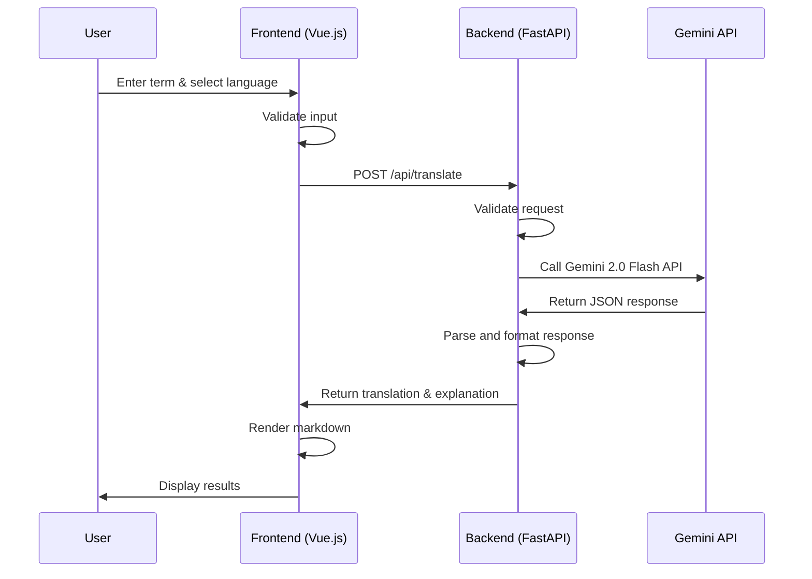
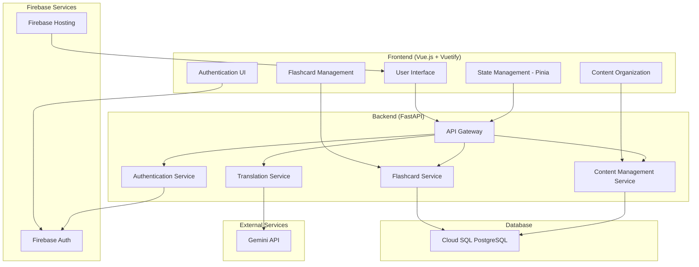
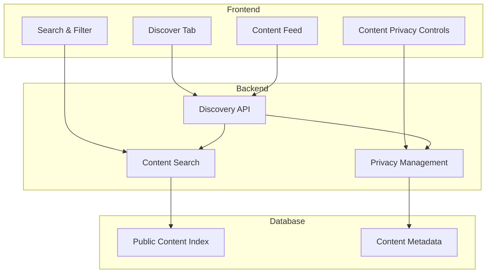
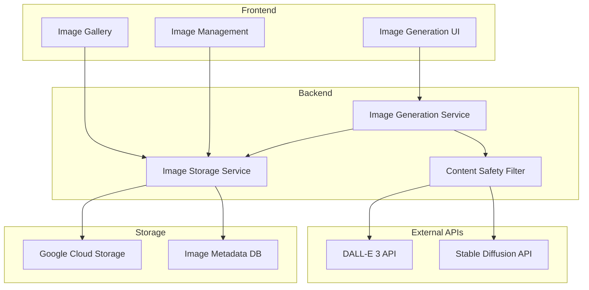

# Vocabloom Technical Design

**Document Version:** 1.4
**Last Updated:** Dec 19, 2024
**Status:** MVP Complete ✅ | Milestone 2 Complete ✅ | Milestone 3 Complete ✅ | Story Generation Complete ✅

---

## 1. Overview

This document outlines the technical architecture, technology choices, and infrastructure for Vocabloom. The MVP has been successfully implemented and deployed to production. Milestone 2 focuses on user account management, content organization, and flashcard features. Milestone 3 includes AI-powered story generation with age-appropriate content and related word recommendations.

**Production URLs:**
- **Frontend**: https://vocabloom.app (custom domain) / https://vocabloom-467020.web.app (Firebase)
- **Backend**: https://vocabloom-api-18560061448.us-central1.run.app
- **GitHub**: https://github.com/yc3136/vocabloom

---

## 2. Tech Stack Selection

### 2.1. Frontend

- **Framework:** Vue.js 3 (with TypeScript)
- **UI Library:** Vuetify 3 (for accessibility and rapid prototyping)
- **State Management:** Vue 3 Composition API (MVP) → Pinia (Milestone 2)
- **Routing:** Vue Router 4
- **Form Handling:** Vue 3 reactive forms
- **Markdown Rendering:** marked.js
- **Testing:** Jest, Vue Testing Library (planned)

### 2.2. Backend

- **Language/Runtime:** Python 3.13
- **Framework:** FastAPI (for high performance, async support, and OpenAPI docs)
- **API:** REST (with OpenAPI/Swagger documentation)
- **Authentication:** Firebase Auth (Milestone 2)
- **Database:** Cloud SQL (PostgreSQL) (Milestone 2) - Relational database
- **ORM:** SQLAlchemy (for database operations)
- **Dependency Management:** Poetry
- **Testing:** Pytest (planned)

### 2.3. AI/ML Integration

- **Provider:** Gemini 2.0 Flash API (primary for LLM-powered translation and explanation)
- **Image Generation:** DALL-E 3 API or Stable Diffusion API (Milestone 4)
- **Integration:** Direct REST API calls using httpx
- **Response Format:** JSON with translation and explanation fields
- **Error Handling:** Graceful fallback with user-friendly error messages

### 2.4. Cloud & Infrastructure

- **Cloud Provider:** Google Cloud Platform (GCP)
- **Core Services:**
  - **Compute:** Cloud Run (for containerized FastAPI backend)
  - **Frontend Hosting:** Firebase Hosting
  - **Authentication:** Firebase Auth (user management, OAuth providers)
  - **Database:** Cloud SQL (PostgreSQL) (relational database for user data and content)
  - **Object Storage:** Google Cloud Storage (GCS) (for static assets and generated images)
  - **Secrets Management:** Secret Manager (for API keys and database credentials)
  - **Monitoring:** Cloud Monitoring, Error Reporting
  - **CI/CD:** GitHub Actions, manual deployment scripts

### 2.5. DevOps & Tooling

- **Containerization:** Docker (for local development and deployment)
- **Version Control:** Git (GitHub)
- **Linting/Formatting:** ESLint, Prettier (frontend); Black, isort (backend)
- **Documentation:** Swagger (API), Markdown (internal docs)

### 2.6. Accessibility & Compliance

- **Accessibility:** WCAG 2.1 AA compliance (planned)
- **Compliance:** GDPR, CCPA (data privacy) (planned)

---

## 3. Setup Specifications

### 3.1. Local Development

- **Minimum Requirements:**  
  - Node.js >= 18.x (for frontend tooling)  
  - Python >= 3.10 (for backend)  
  - Poetry (for Python dependency management)
  - GCloud CLI (for cloud integration)  
  - npm (frontend)
  - Firebase CLI (for local development and deployment)
  - PostgreSQL client (for local database development)

- **Recommended IDE:** VSCode (with recommended extensions for TypeScript, ESLint, Prettier, Python, Docker)

### 3.2. Environments

- **Development:** Local development with hot reload
- **Production:** GCP (Cloud Run + Firebase Hosting + Cloud SQL)

### 3.3. Environment Separation Strategy

The application uses a complete environment separation strategy to ensure local development and production environments never interfere with each other.

#### 3.3.1. Environment Detection

**Backend Environment Detection:**
```python
ENVIRONMENT = os.getenv("ENVIRONMENT", "local")
if ENVIRONMENT == "production":
    # Production logic
else:
    # Local development logic
```

**Frontend Environment Detection:**
```typescript
const isProduction = import.meta.env.PROD;
const isLocal = import.meta.env.DEV;
```

#### 3.3.2. Database Configuration

**Local Development:**
- **Database:** Local PostgreSQL instance
- **Connection:** Direct TCP connection to localhost
- **Credentials:** Environment variables in `.env` files
- **Migration:** Alembic with local database

**Production:**
- **Database:** Cloud SQL PostgreSQL instance
- **Connection:** Cloud SQL Auth Proxy
- **Credentials:** Google Cloud Secret Manager
- **Migration:** Alembic with production database

#### 3.3.3. Secret Management

**Local Development:**
- **Source:** Environment variables in `.env` files
- **Storage:** Local files (gitignored)
- **Access:** Direct environment variable access

**Production:**
- **Source:** Google Cloud Secret Manager
- **Storage:** Encrypted cloud storage
- **Access:** Service account with Secret Manager permissions

#### 3.3.4. Frontend-Backend Communication

**Local Development:**
- **Frontend → Backend:** `http://localhost:8000`
- **Backend → Database:** Local PostgreSQL
- **Authentication:** Firebase Auth (same project as production)

**Production:**
- **Frontend → Backend:** Cloud Run URL (dynamic)
- **Backend → Database:** Cloud SQL
- **Authentication:** Firebase Auth (same project as local)

#### 3.3.5. Configuration Files

**Backend Configuration:**
```
server/
├── .env (local development - gitignored)
├── .env.production (production template)
└── env.example (template for local setup)
```

**Frontend Configuration:**
```
client/
├── .env (local development - gitignored)
├── .env.production (production build)
└── env.example (template for local setup)
```

#### 3.3.6. Environment-Specific Features

**Local Development Benefits:**
- **Offline Development:** Works without internet connection
- **Fast Iteration:** Hot reload for both frontend and backend
- **Debugging:** Full access to logs and error messages
- **Database Control:** Direct access to local database

**Production Benefits:**
- **Scalability:** Cloud Run auto-scaling
- **Security:** Managed secrets and credentials
- **Reliability:** High availability and backups
- **Monitoring:** Cloud Monitoring and Error Reporting

#### 3.3.7. Migration Strategy

**Local Migrations:**
```bash
cd server
poetry run alembic upgrade head  # Uses local database
```

**Note:** Migration files in `server/alembic/versions/` are generated code and should not be committed to version control. They are automatically created based on model changes and applied to the appropriate environment database.

**Production Migrations:**
```bash
# Handled by deployment pipeline
# Uses production database via Cloud SQL
```

#### 3.3.8. Security Considerations

**Local Development:**
- Environment files are gitignored to prevent credential leakage
- Uses same Firebase project as production for authentication testing
- No production secrets are accessible locally

**Production:**
- All secrets stored in Google Cloud Secret Manager
- Service accounts with minimal required permissions
- CORS configured for production domains only

---

## 4. Rationale

- **Suitability:** Vue.js and FastAPI are both modern, high-performance frameworks with strong community support and rapid development cycles. They are well-suited for building scalable, maintainable web applications and APIs.
- **Cloud Provider Choice:**
  - **GCP was chosen over AWS** for the following reasons:
    - **Cost Control:** GCP provides a $300 free credit and always-free tier, with a hard spending limit before you upgrade to a paid account, making it safer for side projects and experimentation.
    - **Gemini Integration:** Native and seamless integration with Gemini API and other Google AI/ML services.
    - **Managed Services:** GCP offers robust managed services for compute, storage, database, and monitoring, all compatible with the project's tech stack.
    - **Developer Experience:** GCP's developer tooling and documentation are well-suited for rapid prototyping and deployment.
- **Database Choice for Milestone 2:**
  - **PostgreSQL on Cloud SQL:** Advanced relational database with excellent JSON support
  - **Advanced Features:** JSONB support, complex queries, better indexing
  - **GCP Integration:** Native Cloud SQL service with automatic backups and high availability
- **Firebase Auth Choice:**
  - **Rapid Development:** Ready-to-use authentication with multiple OAuth providers
  - **Cost Effective:** Generous free tier for authentication services
  - **Security:** Built-in security features and token management
  - **Integration:** Seamless integration with GCP services and PostgreSQL

---

## 5. MVP Design

### 5.1. User Journey

1. **User Input:** User enters an English term and selects a target language
2. **Frontend Processing:** Vue.js validates input and sends POST request to backend
3. **Backend Processing:** FastAPI validates payload and calls Gemini API
4. **Frontend Display:** Results are displayed with markdown rendering

### 5.2. Architecture



### 5.3. Key Components

- **Frontend:** Single-page application with Vue Router, responsive design with Vuetify
- **Backend:** Single endpoint `/api/translate` with input validation and error handling
- **AI Integration:** Gemini 2.0 Flash API with structured JSON responses
- **Deployment:** Firebase Hosting (frontend) + Cloud Run (backend)

### 5.4. Deployment & Operations

- **Frontend:** Firebase Hosting with custom domain (vocabloom.app)
- **Backend:** Cloud Run with automatic SSL/TLS certificates
- **Infrastructure:** GCP project (vocabloom-467020) with Secret Manager for API keys
- **CI/CD:** Manual deployment scripts with dependency checks and health testing
- **Monitoring:** Cloud Monitoring for logs and metrics

---

## 6. Milestone 2: User Account Management, Content Organization & Flashcards

### 6.1. High-Level Architecture



### 6.2. Hybrid User Experience Design

#### 6.2.1. Public vs. Authenticated Features

**Public Features (No Authentication Required):**
- Basic translation lookup and display
- Flashcard generation and preview
- Template selection and customization
- Real-time translation with Gemini API
- Responsive design and accessibility features

**Authenticated Features (Requires Sign-in):**
- Save flashcards to personal collection
- View and manage saved flashcards
- View translation history
- User preferences and settings
- Content organization by original word

#### 6.2.2. User Journey Flow

**Anonymous User Journey:**
1. User visits vocabloom.app
2. User can immediately use translation feature
3. User can generate and preview flashcards
4. When user tries to save a flashcard → authentication prompt
5. User can choose to sign in or continue without saving

**Authenticated User Journey:**
1. User signs in (optional for basic features)
2. All public features available
3. Additional personalized features unlocked
4. Seamless save and management capabilities

#### 6.2.3. Authentication Prompt Strategy

**Trigger Points for Authentication:**
- User clicks "Save Flashcard" button
- User tries to access "My Flashcards" dashboard
- User tries to view translation history

**User Experience:**
- Non-intrusive authentication prompts
- Clear value proposition for signing up
- Option to continue without authentication
- Smooth transition from anonymous to authenticated state

### 6.3. User Account Management

#### 6.3.1. Authentication Architecture

**Technology Stack:**
- **Firebase Authentication:** Primary authentication service
- **Supported Providers:** Email/Password, Google OAuth
- **Frontend Integration:** Firebase Auth SDK for Vue.js
- **Backend Integration:** Firebase Admin SDK for Python

**Key Features:**
- Optional authentication for basic features
- Seamless sign-in flow when needed
- User session management and logout functionality
- Protected API endpoints with middleware authentication
- Password change and reset functionality

#### 6.3.2. Database Schema (PostgreSQL)

**Tables Structure:**

**Users Table (`users`):**
```sql
CREATE TABLE users (
    id VARCHAR(128) PRIMARY KEY, -- Firebase UID
    email VARCHAR(255) UNIQUE NOT NULL,
    display_name VARCHAR(255),
    created_at TIMESTAMP DEFAULT CURRENT_TIMESTAMP,
    last_login_at TIMESTAMP,
    preferences JSONB -- Store user preferences including child info
);
```

**User Preferences Schema:**
```json
{
    "child_name": "string",
    "child_age": "number",
    "preferred_languages": ["string"],
    "content_privacy_default": "private"
}
```

**Content Table (`content`):**
```sql
CREATE TABLE content (
    id SERIAL PRIMARY KEY,
    user_id VARCHAR(128) NOT NULL,
    original_word VARCHAR(255) NOT NULL,
    target_language VARCHAR(10) NOT NULL,
    translation TEXT NOT NULL,
    explanation TEXT,
    is_public BOOLEAN DEFAULT FALSE,
    created_at TIMESTAMP DEFAULT CURRENT_TIMESTAMP,
    updated_at TIMESTAMP DEFAULT CURRENT_TIMESTAMP,
    FOREIGN KEY (user_id) REFERENCES users(id) ON DELETE CASCADE
);
```

**Flashcards Table (`flashcards`):**
```sql
CREATE TABLE flashcards (
    id SERIAL PRIMARY KEY,
    user_id VARCHAR(128) NOT NULL,
    content_id INTEGER NOT NULL,
    original_word VARCHAR(255) NOT NULL,
    translated_word VARCHAR(255) NOT NULL,
    example_sentences JSONB, -- Array of example sentences
    template VARCHAR(50) DEFAULT 'classic',
    colors JSONB, -- Store color scheme as JSON
    created_at TIMESTAMP DEFAULT CURRENT_TIMESTAMP,
    updated_at TIMESTAMP DEFAULT CURRENT_TIMESTAMP,
    FOREIGN KEY (user_id) REFERENCES users(id) ON DELETE CASCADE,
    FOREIGN KEY (content_id) REFERENCES content(id) ON DELETE CASCADE
);
```

**Indexes for Performance:**
```sql
CREATE INDEX idx_content_user_id ON content(user_id);
CREATE INDEX idx_content_original_word ON content(original_word);
CREATE INDEX idx_content_is_public ON content(is_public);
CREATE INDEX idx_content_created_at ON content(created_at);
CREATE INDEX idx_flashcards_user_id ON flashcards(user_id);
CREATE INDEX idx_flashcards_content_id ON flashcards(content_id);
CREATE INDEX idx_users_preferences ON users USING GIN (preferences);
```

#### 6.3.3. Database Security

**Connection Security:**
- **Cloud SQL Proxy:** Secure connection to Cloud SQL instance
- **SSL/TLS Encryption:** Automatic encryption for all database connections
- **IAM Integration:** Service account-based authentication
- **Network Security:** Private IP connections within GCP VPC

**Data Security:**
- **Row-Level Security:** Users can only access their own data
- **Foreign Key Constraints:** Maintain data integrity
- **Input Validation:** SQLAlchemy ORM validation and sanitization
- **Backup Encryption:** Automatic encrypted backups

### 6.4. Content Organization by Original Word

#### 6.4.1. Content Management Architecture

**Content Organization Strategy:**
- All content is organized by the original English word (no separate words table)
- Each content type (translations, flashcards, images, audio) has `original_word` as a key field
- Translations and flashcards are always public for content discovery and caching benefits
- Visibility controls reserved for future personalized content (images, audio, user-specific data)
- Support for multiple translations of the same word in different languages
- Simple and scalable design without over-engineering

#### 6.4.2. LLM Response Caching System

**Prompt Hashing Caching Strategy:**
- Cache LLM responses using prompt hash for cost optimization and performance
- Generate deterministic hash from word, language, and user preferences
- Support personalized prompts while maintaining cache efficiency
- Automatic cache invalidation when prompts change

**Database Schema for Caching:**
```sql
CREATE TABLE cached_translations (
    id SERIAL PRIMARY KEY,
    prompt_hash VARCHAR(64) UNIQUE NOT NULL,
    original_word VARCHAR(255) NOT NULL,
    target_language VARCHAR(50) NOT NULL,
    translation TEXT NOT NULL,
    explanation TEXT,
    usage_count INTEGER DEFAULT 1,
    created_at TIMESTAMP WITH TIME ZONE DEFAULT NOW(),
    updated_at TIMESTAMP WITH TIME ZONE DEFAULT NOW()
);

-- Indexes for performance
CREATE INDEX idx_cached_translations_hash ON cached_translations(prompt_hash);
CREATE INDEX idx_cached_translations_word_lang ON cached_translations(original_word, target_language);
```

**Caching Flow:**
1. Generate prompt hash from word, language, and user preferences
2. Check cache for existing response
3. If found: return cached response and increment usage count
4. If not found: call Gemini API, cache result, return response
5. Support cache invalidation for prompt changes

**Benefits:**
- **Cost Reduction:** Eliminate duplicate API calls
- **Performance:** Instant responses for cached queries
- **Personalization:** Support user-specific prompts
- **Scalability:** Handle any prompt structure changes

**Database Schema:**
```sql
-- Translations table (core content type - always public)
CREATE TABLE translations (
    id SERIAL PRIMARY KEY,
    user_id VARCHAR(128) NOT NULL REFERENCES users(id),
    original_word VARCHAR(255) NOT NULL,
    target_language VARCHAR(50) NOT NULL,
    translation_text TEXT NOT NULL,
    explanation TEXT,
    bookmarked BOOLEAN DEFAULT FALSE,
    created_at TIMESTAMP WITH TIME ZONE DEFAULT NOW()
);

-- Flashcards table (always public for discovery)
CREATE TABLE flashcards (
    id SERIAL PRIMARY KEY,
    user_id VARCHAR(128) NOT NULL REFERENCES users(id),
    original_word VARCHAR(255) NOT NULL,
    target_language VARCHAR(50) NOT NULL,
    translated_word VARCHAR(255) NOT NULL,
    example_sentences JSONB DEFAULT '[]',
    colors JSONB DEFAULT '{"primary": "#6690ff", "secondary": "#64748b"}',
    created_at TIMESTAMP WITH TIME ZONE DEFAULT NOW(),
    updated_at TIMESTAMP WITH TIME ZONE DEFAULT NOW()
);

-- Stories table (Milestone 3 implementation)
CREATE TABLE stories (
    id SERIAL PRIMARY KEY,
    original_words JSONB NOT NULL, -- Array of words used in story generation
    story_title VARCHAR(255) NOT NULL,
    story_content TEXT NOT NULL,
    story_theme VARCHAR(100),
    story_length VARCHAR(50), -- 'short', 'medium', 'long'
    target_age_range VARCHAR(50), -- 'toddler', 'preschool', 'elementary', 'middle_school'
    target_language VARCHAR(50),
    view_count INTEGER DEFAULT 0,
    created_at TIMESTAMP WITH TIME ZONE DEFAULT NOW(),
    updated_at TIMESTAMP WITH TIME ZONE DEFAULT NOW()
);

-- Images table (future implementation - with visibility)
CREATE TABLE images (
    id SERIAL PRIMARY KEY,
    user_id VARCHAR(128) NOT NULL REFERENCES users(id),
    original_word VARCHAR(255) NOT NULL,
    target_language VARCHAR(50) NOT NULL,
    image_url VARCHAR(500) NOT NULL,
    alt_text VARCHAR(255),
    generation_prompt TEXT,
    visibility VARCHAR(20) DEFAULT 'private', -- Simple visibility for future
    created_at TIMESTAMP WITH TIME ZONE DEFAULT NOW()
);

-- Audio table (future implementation - with visibility)
CREATE TABLE audio (
    id SERIAL PRIMARY KEY,
    user_id VARCHAR(128) NOT NULL REFERENCES users(id),
    original_word VARCHAR(255) NOT NULL,
    target_language VARCHAR(50) NOT NULL,
    audio_url VARCHAR(500) NOT NULL,
    audio_type VARCHAR(50) NOT NULL, -- 'pronunciation', 'example_sentence', 'story'
    duration_seconds INTEGER,
    visibility VARCHAR(20) DEFAULT 'private', -- Simple visibility for future
    created_at TIMESTAMP WITH TIME ZONE DEFAULT NOW()
);
```

**Performance Indexes:**
```sql
-- For organizing content by word
CREATE INDEX idx_translations_word_lang ON translations(original_word, target_language);
CREATE INDEX idx_flashcards_word_lang ON flashcards(original_word, target_language);
CREATE INDEX idx_images_word_lang ON images(original_word, target_language);
CREATE INDEX idx_audio_word_lang ON audio(original_word, target_language);

-- For user's content
CREATE INDEX idx_translations_user ON translations(user_id);
CREATE INDEX idx_flashcards_user ON flashcards(user_id);
CREATE INDEX idx_images_user ON images(user_id);
CREATE INDEX idx_audio_user ON audio(user_id);

-- For content discovery (all content is public)
CREATE INDEX idx_translations_created ON translations(created_at);
CREATE INDEX idx_flashcards_created ON flashcards(created_at);
CREATE INDEX idx_stories_created ON stories(created_at);
CREATE INDEX idx_images_created ON images(created_at);
CREATE INDEX idx_audio_created ON audio(created_at);

-- For story discovery and search
CREATE INDEX idx_stories_age_range ON stories(target_age_range);
CREATE INDEX idx_stories_language ON stories(target_language);
CREATE INDEX idx_stories_words ON stories USING GIN(original_words);
CREATE INDEX idx_stories_theme ON stories(story_theme);
```

**Content Discovery Features:**
- Users can browse their content organized by original word
- Search and filter capabilities within user's content
- Public content discovery for all translations and flashcards
- Quick flashcard discovery and sharing
- Unified discovery and search interface (Milestone 3)
- Story generation and discovery (Milestone 3)

**Implementation Benefits:**
- **Simple Design:** No unnecessary `words` table - `original_word` acts as natural key
- **Scalable:** Easy to add new content types (images, audio, stories)
- **Content Discovery:** All translations and flashcards are public for easy discovery
- **Future-Ready:** Simple visibility controls for future personalized content
- **Performance:** Proper indexes for fast queries and discovery
- **Cost Optimization:** LLM response caching reduces API costs and improves performance
- **Resume-Friendly:** Clean, professional database design with caching and discovery features
- **Extensible:** Structure supports advanced features like story generation, image generation and audio

### 6.5. Flashcard System

#### 6.5.1. Flashcard Creation Flow

**Anonymous User Journey:**
1. User performs translation lookup (no authentication required)
2. System displays "Create Flashcard" button
3. User opens flashcard creation modal
4. User selects example sentences and customizes appearance
5. User can preview flashcard without saving
6. When user clicks "Save" → authentication prompt appears
7. User can sign in to save or continue without saving

**Authenticated User Journey:**
1. User performs translation lookup
2. System displays "Create Flashcard" button
3. User opens flashcard creation modal
4. User selects example sentences and customizes appearance
5. User saves flashcard directly to PostgreSQL

**Key Features:**
- Multiple example sentence selection
- Template-based customization (Classic, Modern, Minimal)
- Color and font customization
- Category organization (authenticated users only)
- Real-time preview without saving

#### 6.5.2. Flashcard Management (Authenticated Only)

**Dashboard Features:**
- Grid and list view modes
- Search and filter functionality
- Sorting options (date, alphabetical, last modified)

**Template System:**
- 3 predefined templates (Classic, Modern, Minimal)
- Customizable colors, fonts, and layouts
- Responsive design for desktop and mobile
- Professional appearance for printing

### 6.6. Story Generation System (Milestone 3)

#### 6.6.1. Story Generation Architecture

**AI Integration:**
- Gemini 2.0 Flash API for story generation
- Prompt engineering for age-appropriate content
- Multi-word story generation with context preservation
- Theme and length customization

**Story Generation Flow:**
1. User enters words or selects from suggested words
2. User customizes story parameters (theme, length, age range)
3. System generates story using Gemini API with structured prompt
4. Story is displayed with markdown rendering
5. Story is automatically saved to database for discovery

#### 6.6.2. Story Management

**Story Storage:**
- PostgreSQL with JSONB for word arrays
- View count tracking for analytics
- Full-text search capabilities

**Story Discovery:**
- All stories available in discovery feed
- Age-appropriate filtering
- Language and theme-based categorization
- Trending stories based on view count

### 6.7. Content Discovery & Search System (Milestone 3)

#### 6.7.1. Discovery Architecture

**Dual-Mode Interface:**
- **Discovery Mode:** System-recommended content when no search input
- **Search Mode:** Full-text search when keywords are entered
- Seamless transition between modes

**Content Aggregation:**
- Unified API endpoint for all content types
- Consistent content card design
- Real-time filtering and sorting
- Infinite scroll or pagination

#### 6.7.2. Search Implementation

**Full-Text Search:**
- PostgreSQL full-text search across all content
- Search across translations, flashcards, and stories
- Relevance scoring and ranking
- Autocomplete and search suggestions

**Advanced Filtering:**
- Language filter (multi-select)
- Age range filter (toddler, preschool, elementary, middle school)
- Content type filter (flashcards, stories, translations)
- Date range filter
- Sort options (relevance, newest, most popular, most viewed)

#### 6.7.3. Content Recommendation

**Recommendation Algorithm:**
- Trending content based on view count and engagement
- Age-appropriate content filtering
- Language preference matching
- Featured content curation

### 6.8. API Endpoints

#### 6.8.1. Public Endpoints (No Authentication)
- `POST /api/translate` - Basic translation with caching (existing MVP endpoint)
- `POST /api/flashcards/preview` - Generate flashcard preview
- `GET /api/cache/stats` - Get cache statistics (usage counts, hit rates)

#### 6.8.2. Authentication Endpoints
- `POST /api/auth/register` - User registration via Firebase Auth
- `POST /api/auth/login` - User login via Firebase Auth
- `POST /api/auth/logout` - User logout
- `POST /api/auth/change-password` - Change password
- `POST /api/auth/reset-password` - Reset password

#### 6.8.3. Protected Endpoints (Requires Authentication)

**Content Management (by Original Word):**
- `GET /api/words` - List unique words for user (grouped by original_word)
- `GET /api/words/{original_word}` - Get all content for a specific word
- `GET /api/words/discover` - Discover public content by word and language

**Translations:**
- `GET /api/words/{original_word}/translations` - List translations for word
- `POST /api/words/{original_word}/translations` - Add translation
- `PUT /api/translations/{id}` - Update translation
- `DELETE /api/translations/{id}` - Delete translation
- `GET /api/translations/history` - Get user's translation history

**Flashcards:**
- `GET /api/words/{original_word}/flashcards` - List flashcards for word
- `POST /api/words/{original_word}/flashcards` - Add flashcard
- `PUT /api/flashcards/{id}` - Update flashcard
- `DELETE /api/flashcards/{id}` - Delete flashcard
- `GET /api/flashcards` - Get all user's flashcards (with filtering)

**User Management:**
- `GET /api/user/preferences` - Get user preferences
- `PUT /api/user/preferences` - Update user preferences

**Public Discovery:**
- `GET /api/words/public` - List all public words for discovery
- `GET /api/words/{original_word}/public` - Get public content for word
- `GET /api/flashcards/discover` - Discover public flashcards
- `GET /api/translations/discover` - Discover public translations

**Story Generation (Milestone 3):**
- `POST /api/stories/generate` - Generate story from words and parameters
- `GET /api/stories` - Get all stories for discovery
- `GET /api/stories/discover` - Discover stories with filtering

**Content Discovery & Search (Milestone 3):**
- `GET /api/discover` - Get recommended content (discovery mode)
- `GET /api/discover/search` - Search content with filters (search mode)
- `GET /api/discover/trending` - Get trending content
- `GET /api/discover/featured` - Get featured content

### 6.9. State Management

**Pinia Stores:**
- **Auth Store:** User authentication state and methods
- **Content Store:** Word-based content organization and management
- **Flashcard Store:** Flashcard-specific operations and state
- **Translation Store:** Translation history and current translation state
- **User Store:** User preferences and profile management

**Frontend Organization:**
```
/words
├── /list - Word list (organized by original word)
├── /{original_word} - Word detail page showing all content types
├── /{original_word}/translations - Translation management
├── /{original_word}/flashcards - Flashcard management
└── /{original_word}/images - Image gallery (future)

/discover (future)
├── / - Public content discovery
├── /search - Search public content
└── /{original_word} - Public word detail page
```

**Content Organization UI:**
- Word list with content type indicators (translation count, flashcard count)
- Word detail page showing all content types in tabs/sections
- Content type-specific management interfaces
- Public content discovery interface
- Search and filter capabilities
- **Content Store:** Content data and CRUD operations (authenticated)
- **Flashcard Store:** Flashcard data and CRUD operations (authenticated)
- **Translation Store:** Current translation state (public)
- **User Store:** User preferences and settings
- **Story Store:** Story generation and management (Milestone 3)
- **Discovery Store:** Content discovery and search state (Milestone 3)

**Anonymous User State:**
- Current translation results
- Flashcard preview data
- UI state and preferences (local storage)

**Authenticated User State:**
- All anonymous user state
- Saved content collection
- Saved flashcards collection
- User preferences and settings

### 6.10. Deployment Considerations

#### 6.10.1. Cloud SQL Setup

**Required Cloud SQL Configuration:**
- **Instance Type:** PostgreSQL 14 or higher
- **Machine Type:** db-f1-micro (free tier) or db-g1-small for production
- **Storage:** 10GB minimum (SSD)
- **Backup:** Automatic daily backups
- **High Availability:** Optional for production
- **Connections:** Cloud SQL Proxy for secure connections

#### 6.10.2. Environment Variables

**Backend Environment:**
- Database connection string via Secret Manager
- Firebase Admin SDK credentials
- API keys and service account details
- Environment-specific configurations

**Frontend Environment:**
- Firebase configuration for authentication
- API endpoints and service URLs
- Feature flags and environment indicators

#### 6.10.3. Database Migration

**Alembic for Database Migrations:**
- Version-controlled schema changes
- Automated migration scripts
- Rollback capabilities
- Environment-specific migrations

### 6.11. Testing Strategy

#### 6.11.1. Unit Tests

**Frontend Testing:**
- Component testing with Vue Test Utils
- Store testing for Pinia state management
- Authentication flow testing
- UI interaction testing

**Backend Testing:**
- API endpoint testing with pytest
- Database operation testing
- Authentication middleware testing
- Error handling validation

#### 6.11.2. Integration Tests

**Database Integration Tests:**
- PostgreSQL connection and operations
- Firebase Auth token verification
- User data persistence and retrieval
- Content and flashcard CRUD operations with database

**Authentication Flow Tests:**
- User registration and login
- Protected endpoint access
- Token validation and refresh
- Anonymous vs. authenticated user flows

---

## 7. Milestone 3: Public Content Discovery

### 7.1. Architecture Overview



### 7.2. Public Content Discovery Features

#### 7.2.1. Discover Tab Implementation
- **Feed-like Interface:** Infinite scroll or pagination for public content
- **Content Cards:** Rich display of translations, explanations, and metadata
- **Search & Filter:** By language, topic, keywords, or user
- **Anonymous Access:** No authentication required for browsing

#### 7.2.2. Content Privacy System
- **Privacy Controls:** Toggle between public and private for each content item
- **Default Privacy:** All content private by default
- **Privacy Management:** Bulk privacy setting changes
- **Privacy Indicators:** Clear visual indicators for public vs private content

#### 7.2.3. Enhanced Content Discovery
- **Related Content:** Show public content when entering new words
- **Content Statistics:** Display usage metrics for words
- **Alternative Translations:** Discover different approaches to translation

### 7.3. Database Schema Extensions

**Content Privacy Index:**
```sql
CREATE INDEX idx_content_privacy_language ON content(is_public, target_language);
CREATE INDEX idx_content_privacy_created ON content(is_public, created_at);
```

**Content Search Optimization:**
```sql
CREATE INDEX idx_content_search ON content USING GIN (to_tsvector('english', original_word || ' ' || translation));
```

### 7.4. API Endpoints

**Public Discovery Endpoints:**
- `GET /api/discover` - Get public content feed
- `GET /api/discover/search` - Search public content
- `GET /api/discover/word/{word}` - Get public content for specific word

**Privacy Management Endpoints:**
- `PUT /api/content/{id}/privacy` - Update content privacy
- `PUT /api/content/bulk-privacy` - Bulk privacy updates

---

## 8. Milestone 4: Image Generation & Visual Content

### 8.1. Architecture Overview



### 8.2. Image Generation Implementation

#### 8.2.1. API Integration Strategy
- **Primary Provider:** DALL-E 3 API for high-quality images
- **Fallback Provider:** Stable Diffusion API for cost optimization
- **Prompt Engineering:** Optimized prompts for educational content
- **Content Safety:** Built-in filtering for inappropriate content

#### 8.2.2. Image Storage & Management
- **Cloud Storage:** Google Cloud Storage for image files
- **Metadata Database:** PostgreSQL table for image metadata
- **CDN Integration:** Fast image delivery via Cloud CDN
- **Image Optimization:** Automatic resizing and compression

#### 8.2.3. User Experience Features
- **Generation Quotas:** User-specific limits and usage tracking
- **Progress Indicators:** Real-time generation status
- **Error Handling:** Graceful fallbacks and retry mechanisms
- **Image Gallery:** User's generated images with search and filter

### 8.3. Database Schema Extensions

**Images Table:**
```sql
CREATE TABLE images (
    id SERIAL PRIMARY KEY,
    user_id VARCHAR(128) NOT NULL,
    content_id INTEGER,
    original_word VARCHAR(255) NOT NULL,
    prompt TEXT NOT NULL,
    image_url VARCHAR(500) NOT NULL,
    thumbnail_url VARCHAR(500),
    generation_provider VARCHAR(50) NOT NULL,
    generation_cost DECIMAL(10,4),
    created_at TIMESTAMP DEFAULT CURRENT_TIMESTAMP,
    FOREIGN KEY (user_id) REFERENCES users(id) ON DELETE CASCADE,
    FOREIGN KEY (content_id) REFERENCES content(id) ON DELETE SET NULL
);
```

**User Image Quotas:**
```sql
ALTER TABLE users ADD COLUMN image_quota_used INTEGER DEFAULT 0;
ALTER TABLE users ADD COLUMN image_quota_limit INTEGER DEFAULT 10;
```

### 8.4. API Endpoints

**Image Generation Endpoints:**
- `POST /api/images/generate` - Generate image for word
- `GET /api/images` - Get user's generated images
- `DELETE /api/images/{id}` - Delete generated image
- `GET /api/images/quota` - Get user's image generation quota

---

## 9. Milestone 5: Advanced Learning Features

### 9.1. Bedtime Story Generation

#### 9.1.1. Story Generation Architecture
- **Single Word Stories:** Simple stories based on one word
- **Multi-Word Stories:** Complex stories incorporating multiple selected words
- **Personalization:** Use child's name and age from user preferences
- **Story Customization:** Length and complexity controls

#### 9.1.2. Implementation Details
- **Prompt Engineering:** Specialized prompts for educational storytelling
- **Content Safety:** Age-appropriate content filtering
- **Story Storage:** Save and retrieve generated stories
- **Story Sharing:** Share stories with other users

### 9.2. Flashcard Enhancements

#### 9.2.1. Advanced Organization
- **Hashtag System:** Flexible categorization with hashtags
- **Bulk Operations:** Select and manage multiple flashcards
- **Search & Filter:** Advanced search with hashtag filtering
- **Suggested Tags:** AI-powered tag suggestions

#### 9.2.2. Export & Printing
- **PDF Generation:** High-quality printable flashcards
- **Multiple Formats:** PDF, CSV export options
- **Custom Layouts:** Professional printing templates
- **Batch Export:** Export multiple flashcards at once

#### 9.2.3. Interactive Learning Modes
- **Slideshow Mode:** Study flashcards with navigation controls
- **Quiz Mode:** Multiple choice and fill-in-the-blank questions
- **Progress Tracking:** Study statistics and performance metrics
- **Spaced Repetition:** Intelligent review scheduling

### 9.3. Story Generation System

#### 9.3.1. Core Features
- **AI-Powered Generation:** Uses Gemini 2.0 Flash API for high-quality story creation
- **Age-Appropriate Content:** Tailored content based on child's age (toddler, preschool, elementary, middle school)
- **Multi-Word Support:** Generates stories incorporating multiple words and related vocabulary
- **Theme Customization:** Educational, adventure, bedtime, fantasy, nature, friendship, and custom themes
- **Length Control:** Configurable story length (50-500 words)
- **Language Support:** Full story generation in target language (Chinese, Spanish, etc.)

#### 9.3.2. Related Words System
- **Contextual Recommendations:** AI-generated related words specific to input word
- **Age-Appropriate Vocabulary:** Word suggestions tailored to child's developmental level
- **Interactive Selection:** Users can select which related words to include in story
- **Translation Support:** Related words provided in both English and target language

#### 9.3.3. Story Management
- **User Collections:** Personal story library with search and filtering
- **Story Metadata:** Title, theme, length, age range, target language tracking
- **Content Display:** Markdown rendering with word highlighting
- **Search Functionality:** Search by title, content, and individual words

#### 9.3.4. Technical Implementation
- **Database Schema:** JSONB storage for word arrays and story metadata
- **Prompt Engineering:** Sophisticated prompts for age-appropriate, educational content
- **Error Handling:** Graceful fallbacks and user-friendly error messages
- **Caching Strategy:** LLM response caching for cost optimization

### 9.4. API Endpoints

**Story Generation:**
- `POST /api/stories/generate` - Generate AI-powered story with age-appropriate content
- `POST /api/stories/related-words` - Get contextually relevant words for story generation
- `GET /api/stories` - Get user's generated stories with search and filtering
- `POST /api/stories` - Save generated story to user's collection
- `GET /api/stories/{id}` - Get specific story by ID
- `DELETE /api/stories/{id}` - Delete story from user's collection

**Flashcard Enhancements:**
- `POST /api/flashcards/bulk-tags` - Bulk tag operations
- `POST /api/flashcards/export` - Export flashcards
- `GET /api/flashcards/quiz` - Generate quiz from flashcards
- `POST /api/flashcards/progress` - Track study progress

---

## 10. Milestone 6: Community Features & Advanced Platform

### 10.1. Community Features

#### 10.1.1. Community Forums
- **Discussion Boards:** Topic-based discussions
- **User Profiles:** Enhanced user profiles with activity
- **Content Sharing:** Share study materials and resources
- **Moderation Tools:** Content moderation and user management

#### 10.1.2. Gamification System
- **Achievement System:** Badges and rewards for engagement
- **Progress Tracking:** Learning streaks and milestones
- **Leaderboards:** Community rankings and competitions
- **Points System:** Earn points for various activities

### 10.2. Premium Features

#### 10.2.1. Subscription Management
- **Tiered Plans:** Free, Premium, and Pro tiers
- **Feature Gating:** Premium-only features and limits
- **Payment Integration:** Secure payment processing
- **Usage Analytics:** Premium feature usage tracking

#### 10.2.2. Advanced Content Generation
- **Audio Generation:** Text-to-speech for pronunciations
- **Video Clips:** Short educational video content
- **Custom Prompts:** Advanced prompt customization
- **Multi-language UI:** Internationalization support

### 10.3. Administrative Features

#### 10.3.1. Analytics Dashboard
- **User Analytics:** Engagement metrics and user behavior
- **Content Analytics:** Popular content and trends
- **System Health:** Performance and error monitoring
- **Business Metrics:** Conversion and retention data

#### 10.3.2. Content Moderation
- **Automated Filtering:** AI-powered content screening
- **Manual Review:** Human moderation queue
- **User Reporting:** Community-driven content flagging
- **Policy Enforcement:** Automated and manual actions

### 10.4. Technical Implementation

#### 10.4.1. Scalability Considerations
- **Microservices Architecture:** Service decomposition for scale
- **Caching Strategy:** Redis for session and content caching
- **CDN Optimization:** Global content delivery
- **Database Sharding:** Horizontal scaling for user data

#### 10.4.2. Security Enhancements
- **Advanced Authentication:** Multi-factor authentication
- **Rate Limiting:** API usage limits and protection
- **Content Security:** Advanced content filtering
- **Privacy Controls:** Enhanced user privacy options

---

## 11. Performance & Scalability

### 11.1. Performance Targets

- **API Response Time:** < 200ms for most endpoints
- **Image Generation:** < 30 seconds for completion
- **Page Load Time:** < 2 seconds for initial load
- **Database Queries:** < 100ms for standard operations

### 11.2. Scalability Strategy

- **Horizontal Scaling:** Cloud Run auto-scaling
- **Database Optimization:** Proper indexing and query optimization
- **Caching Layers:** Redis for frequently accessed data
- **CDN Integration:** Global content delivery optimization

### 11.3. Monitoring & Observability

- **Application Monitoring:** Cloud Monitoring integration
- **Error Tracking:** Comprehensive error reporting
- **Performance Metrics:** Real-time performance monitoring
- **User Analytics:** Detailed user behavior tracking 